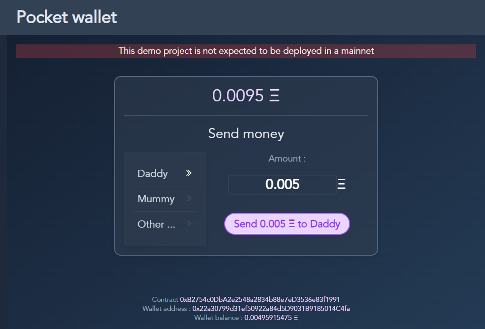
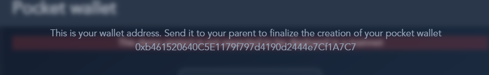
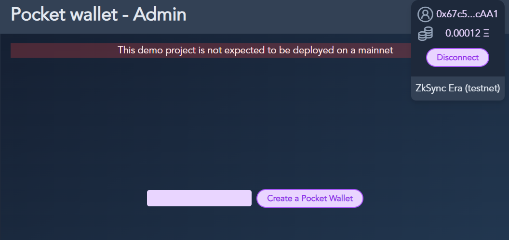
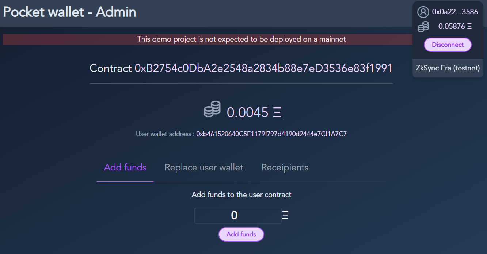

# Pocket wallet

> The crypto wallet for children

This demo project allow a parent (the controller) to manage and provide funds for a child in a smart contract.



## Purpose

A random wallet is generated by the app for the child. 
This wallet will just own some ETH for gas, so if the wallet is lost, it is not a big deal.

The wallet is the key of a contract where the user own money and can send it eo receipients.

## First time initialization

The first time the child accesses the app, a wallet is generated.



The parent will connect to the administration app and enter the child wallet address



A pocket wallet contract will be created for the user, and the parent will be able to manage the account



## Testing

You can test the applications directly on Sepolia Testnet or ZkSync Era Testnet.

On others networks, you will have to deploy the Pocket Wallet Factory and change the settings in the stores (store/index.js) on both apps. 

## Factory Deployment

```shell
## Hardhat commands 
npx hardhat help
npx hardhat test
REPORT_GAS=true npx hardhat test
npx hardhat node

# Deployment

## Default
npx hardhat run scripts/deploy.ts

## Sepolia
npx hardhat run scripts/deploy.ts --network sepolia

## ZkSync Era
npx hardhat deploy-zksync --network zkSyncTestnet --script deploy-zksync.ts
```

## Factories addresses by chain

- Ethereum Sepolia Testnet : 0xc07C8167514648C50a4acD487d0559EBAfD24123
- ZkSync Era Testnet : 0x9935BA8354E79ab7FeDF473a010531CE659B022E

